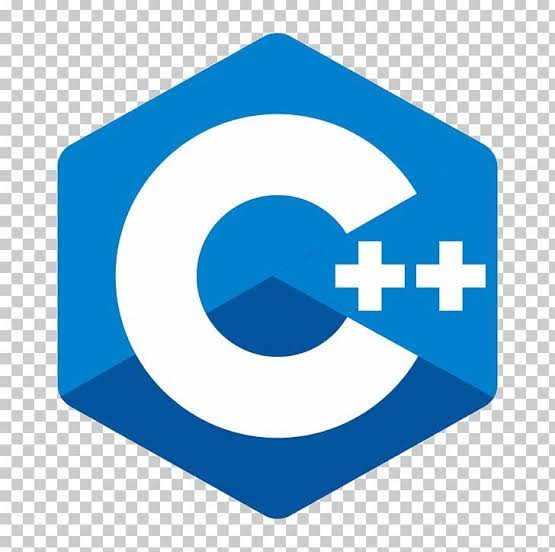
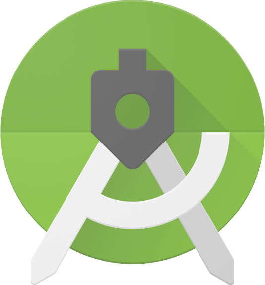
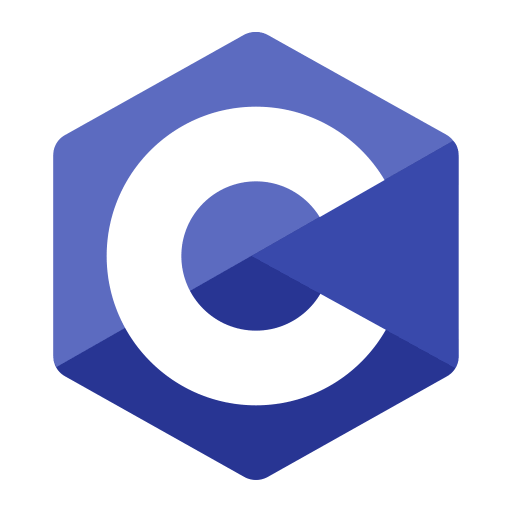
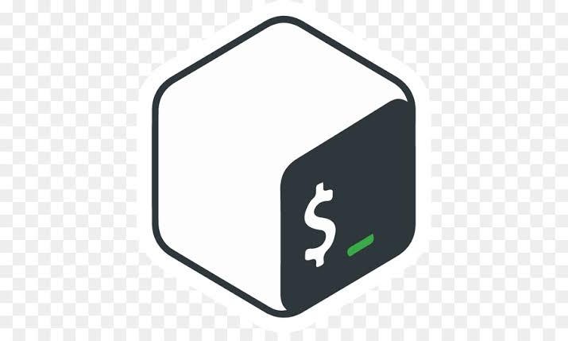

# Hi there 👋
## I am Sachin Thankachan

<h3 align="center">Software Developer</h3>

<h3 align="center">Ethical Hacker</h3>

<h3 align="center">3D artist</h3>

  

- 🌱 I’m currently learning **C#,php**

- 👨‍💻 All of my projects are available [here](https://github.com/sachinthankachan?tab=repositories)

- ⚡ Fun fact **I am a student**

# My tools

